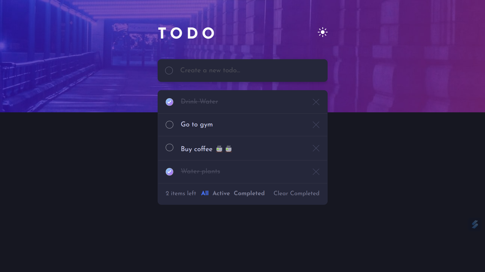
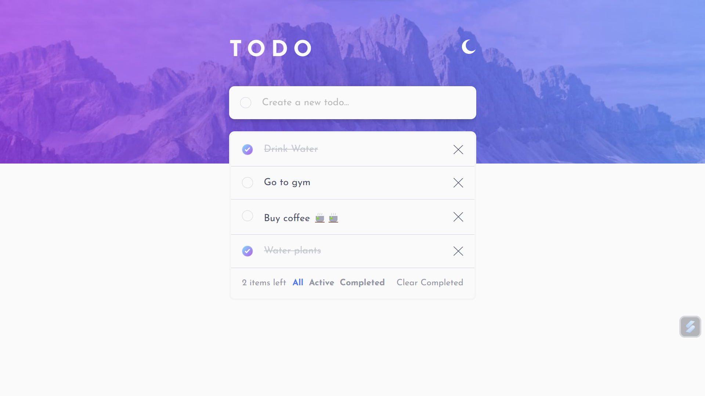

# ToDo App using React JS

##  Screenshot

## Project Links
- [Live Demo](https://todo-app-react-frontendmentor-soln.netlify.app/)
- [Solution Link](https://github.com/Psargar616/todo-app-react)

## Built Using 
- ReactJS

## New Learnings
- useContext()
- useState()
- useEffect()
- ReactComponents
- Adding dark theme to webpage
